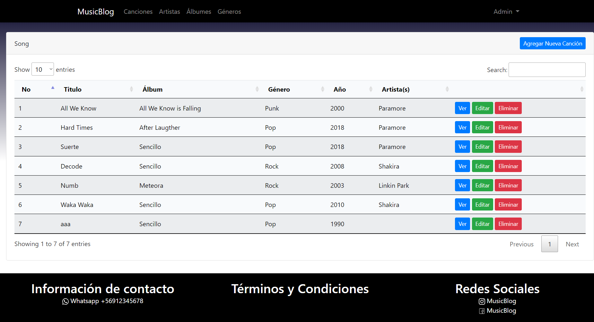

# Plataforma tipo blog de música

## Introducción
Para facilitar la introducción a las tecnologías y métodos de trabajo de la empresa se propuso un proyecto de introducción que consistió en crear un blog de música, donde podrían iniciar sesión diferentes tipos de usuarios. Un usuario administrador que podría agregar, editar y borrar artistas, canciones y álbumes o sencillos. Un usuario visitante el cual podría ver la información que es administrada por los administradores y marcar sus preferencias de contenido. Los requisitos para este proyecto fueron en general básicos para un blog, y tenían como objetivo el poder agregar funcionalidades a medida que se desarrollaba. El tiempo límite para el desarrollo de este proyecto era de una semana ya que su objetivo era funcionar como una introducción para los proyectos reales en los que se estaría trabajando durante la práctica.

## Plataforma
A continuación se muestran las imagenes de la estructura general de la plataforma:

Imagen de la página principal de la plataforma, donde se pueden ver las muestra de algunos elementos.

Imagen de la estructura que tienen las tablas de administración, donde se cuenta con botones para crear, editar, ver y eliminar registros.

Imagen de la estructura que tienen los formularios de creación y edición de los registros de las tablas.

Imagen de la ventana emergente que aparece en caso de intentar eliminar un registro de las tablas.

Imagen de la visualización individual de los registros de las tablas.

